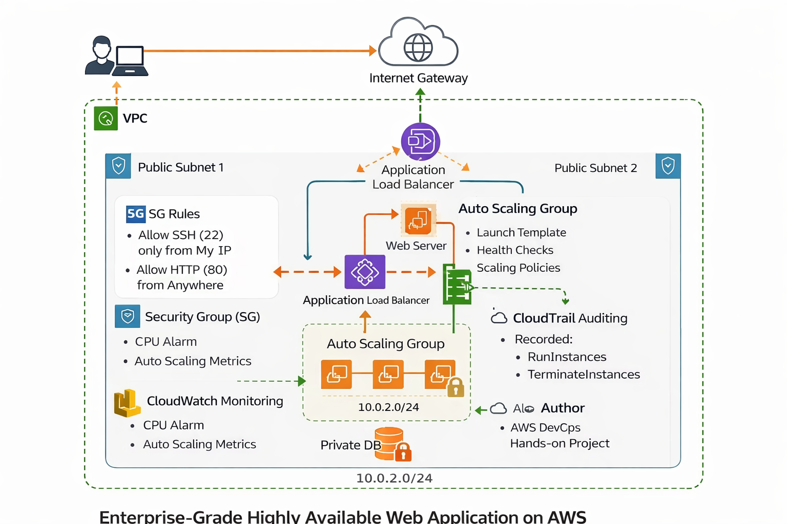

<p align="center">


</p>

<h1 align="center">🚀 AWS Enterprise Web Architecture</h1>
<h3 align="center">Highly Available • Auto Scaling • Self Healing • Production Ready</h3>

---

## 🏗️ Architecture Diagram


---

## 🌍 Project Overview

This project demonstrates how to design and deploy a **Production-Ready AWS Infrastructure** capable of handling real-world traffic using **Auto Scaling, Load Balancing, Monitoring, and Security auditing.**

This architecture guarantees:

✔ High Availability  
✔ Fault Tolerance  
✔ Self Healing Infrastructure  
✔ Automatic Scaling  
✔ Real-time Monitoring  
✔ Security & Audit Logging  

---

## ☁️ AWS Services Used

| Category | Services |
|---|---|
| 🌐 Networking | VPC, Subnets, Internet Gateway, Route Tables |
| 💻 Compute | EC2 Ubuntu, AMI |
| ⚖️ Load Balancing | Application Load Balancer |
| 📈 Scaling | Auto Scaling Group |
| 📊 Monitoring | CloudWatch |
| 🔐 Security | Security Groups |
| 🕵️ Auditing | CloudTrail |

---

## 🔄 Architecture Flow

Users → Application Load Balancer → Auto Scaling EC2 → CloudWatch → CloudTrail


---

## ⚙️ Automated Server Setup

`scripts/install_apache.sh`

```bash
#!/bin/bash
sudo apt update -y
sudo apt install apache2 -y
sudo systemctl start apache2
sudo systemctl enable apache2
echo "<h1>AWS Auto Scaling Server $(hostname)</h1>" > /var/www/html/index.html


🧪 Validation Tests

Test	                       Result
Load Balancer DNS Working	✅
Auto Healing Test	        ✅
Auto Scaling Test	        ✅
CloudWatch Alarm Created	✅
CloudTrail Logs Verified	✅


🎯 Key Achievements

Built custom VPC networking from scratch

Deployed Ubuntu web servers on EC2

Implemented Application Load Balancer

Configured Auto Scaling Group

Enabled CloudWatch monitoring & alarms

Enabled CloudTrail auditing

Tested self-healing infrastructure

👨‍💻 Author

Irfan Pasha 

AWS DevOps Hands-On Project